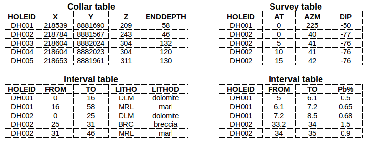

# DrillHoles

[![Build Status][build-img]][build-url] [![Coverage][codecov-img]][codecov-url]

`DrillHoles.jl` is a package written in Julia for drill holes desurvey and compositing.

## Installation

First, it is necessary to install Julia. Installation instructions for Windows, Linux and macOS are available [here](https://julialang.org/downloads/platform/).

To install `DrillHoles.jl` package: open a terminal, type `julia` to open the REPL and then install the package with the following command. Additionally, the `GeoStats.jl` package is also installed to run the example later.

```julia
using Pkg; Pkg.add("DrillHoles"); Pkg.add("GeoStats")
```

## Drill hole tables

Before using the package, it is necessary to have a collar table, a survey table and at least one interval table (such as assay and lithology). They can be passed as CSV file or `DataFrame`. Examples of data tables are shown below:

<p align="center">
  
</p>

## Usage example

```julia
using DrillHoles

# Inform drill hole tables and main columns
collar = Collar(file="C:/collar.csv", holeid=:HOLEID, x=:X, y=:Y, z=:Z)
survey = Survey(file="C:/survey.csv", holeid=:HOLEID, at=:AT, azm=:AZM, dip=:DIP)
assay  = Interval(file="C:/assay.csv", holeid=:HOLEID, from=:FROM, to=:TO)
litho  = Interval(file="C:/litho.csv", holeid=:HOLEID, from=:FROM, to=:TO)

# Desurvey drill hole tables
dh = drillhole(collar, survey, [assay, litho])

# The DrillHole object created have 4 components
dh.table  # the desurveyed drill hole table
dh.trace  # the trace file with coordinates at surveyed depths
dh.pars   # the main column names
dh.warns  # the table of warning and errors identified during desurvey

# Composite drillhole using :equalcomp mode, which seeks to create composites
# with the exact `interval` length;  borders are discarded if have length below
# `mincomp`. Max composite length = `interval`
comps = composite(dh, interval=1.0, zone=:LITHO, mode=:equalcomp)

# Composite drillhole using :equalcomp mode; composite lengths are defined
# seeking to include all possible intervals with length above `mincomp`.
# Max composite length = 1.5*`interval`
comps = composite(dh, interval=1.0, zone=:LITHO, mode=:nodiscard)

# To use the drill hole file as PointSet into GeoStats.jl framework
using GeoStats
pointset = georef(comps.table, (:X,:Y,:Z))
```

## Documentation

The documentation of the main functions are available as [docstrings](https://juliahub.com/docs/DrillHoles)

[build-img]: https://img.shields.io/github/workflow/status/rmcaixeta/DrillHoles.jl/CI?style=flat-square
[build-url]: https://github.com/rmcaixeta/DrillHoles.jl/actions

[codecov-img]: https://codecov.io/gh/rmcaixeta/DrillHoles.jl/branch/master/graph/badge.svg
[codecov-url]: https://codecov.io/gh/rmcaixeta/DrillHoles.jl
