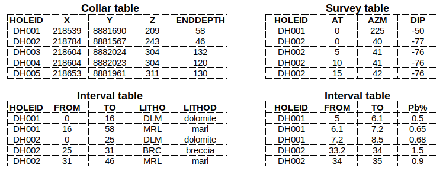

# DrillHoles.jl

[![Build Status][build-img]][build-url] [![Coverage][codecov-img]][codecov-url]

Desurvey and composite drill hole tables from the mining industry.

## Installation

Get the latest stable release with Julia's package manager:

```
] add DrillHoles
```

## Usage

Given a *collar table*, a *survey table* and at least one *interval
table* (such as assay and lithology), the function `desurvey` can
be used for desurveying and compositing. Examples of these tables
are shown bellow:



- *Collar table*: stores the coordinates (X, Y, Z) of each drill
hole with given ID (HOLEID).
- *Survey table*: stores the arc length (AT) and azimuth (AZM) and
dip (DIP) angles along the drill hole trajectory. Together with the
collar table it fully specifies the trajectory.
- *Interval table*: stores the actual measurements taken on cylinders
of rock defined by an interval of arc lenghts (FROM and TO). Usually,
there are multiple interval tables with different types of measurements.

Assuming that each of these tables was loaded into a
[Tables.jl](https://github.com/JuliaData/Tables.jl) table
(e.g. CSV.File, DataFrame), we can use the following constructors
to automatically detect the columns:

```julia
using DrillHoles
using CSV

collar = Collar(CSV.File("collar.csv"))
survey = Survey(CSV.File("survey.csv"))
assay  = Interval(CSV.File("assay.csv"))
litho  = Interval(CSV.File("litho.csv"))
```

If the columns of the tables follow an exotic naming convention,
users can manually specify the names with keyword arguments:

```julia
# manually specify column with hole ID
Collar(CSV.File("collar.csv"), holeid = "MyHoleID")
```

Please check the documentation of `Collar`, `Survey` and `Interval`
for more details.

By default, the `desurvey` function returns a
[geospatial table](https://juliaearth.github.io/GeoStats.jl/stable/data.html)
compatible with [GeoStats.jl](https://github.com/JuliaEarth/GeoStats.jl).
It supports different dip angle conventions from open pit and underground
mining as well as different stepping methods:

```julia
samples = desurvey(collar, survey, [assay, litho])
```

The option `geom` can be used to control the output format, and the option
`len` can be used for compositing. Please check the documentation for more
details.

[build-img]: https://img.shields.io/github/actions/workflow/status/JuliaEarth/DrillHoles.jl/CI.yml?branch=master&style=flat-square
[build-url]: https://github.com/JuliaEarth/DrillHoles.jl/actions

[codecov-img]: https://codecov.io/gh/JuliaEarth/DrillHoles.jl/branch/master/graph/badge.svg
[codecov-url]: https://codecov.io/gh/JuliaEarth/DrillHoles.jl
