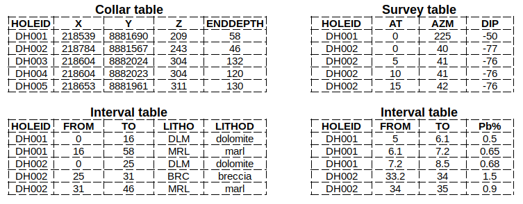

# DrillHoles.jl

[![Build Status][build-img]][build-url] [![Coverage][codecov-img]][codecov-url]

Desurvey and composite drill hole tables from the mining industry.

## Installation

Get the latest stable release with Julia's package manager:

```
] add DrillHoles
```

## Usage

Given a *collar table*, a *survey table* and at least one *interval
table* (such as assay and lithology), the function `desurvey` can
be used for desurveying and compositing. Examples of these tables
are shown bellow:



- *Collar table*: stores the coordinates (X, Y, Z) of each drill
hole with given ID (HOLEID).
- *Survey table*: stores the arc length (AT) and azimuth (AZM) and
dip (DIP) angles along the drill hole trajectory. Together with the
collar table it fully specifies the trajectory.
- *Interval table*: stores the actual measurements taken on cylinders
of rock defined by an interval of arc lenghts (FROM and TO). Usually,
there are multiple interval tables with different types of measurements.

### Loading tables

Assuming that each of these tables is loaded into a
[Tables.jl](https://github.com/JuliaData/Tables.jl)
table (e.g. CSV.File, DataFrame, MySQL):

```julia
using CSV

ctable = CSV.File("collar.csv")
stable = CSV.File("survey.csv")
atable = CSV.File("assay.csv")
ltable = CSV.File("litho.csv")
```

We can use the following constructors to automatically
detect the required columns:

```julia
using DrillHoles

collar = Collar(ctable)
survey = Survey(stable)
assay  = Interval(atable)
litho  = Interval(ltable)
```

If the columns of the tables follow an exotic naming convention,
users can manually specify the names with keyword arguments. For
example, one can specify the column with  the `holeid`:

```julia
Collar(ctable, holeid = "MyHoleID")
```

Please check the documentation of `Collar`, `Survey` and `Interval`
for more details.

### Desurveying & compositing

By default, the `desurvey` function returns a `GeoTable` compatible with
the [GeoStats.jl](https://github.com/JuliaEarth/GeoStats.jl) framework.
It supports different dip angle conventions from open pit and underground
mining as well as different stepping methods:

```julia
samples = desurvey(collar, survey, assay, litho, options...)
```

The `len` option can be used for compositing samples. For example,
one can obtain samples of approximately 5 meters by setting `len=5u"m"`.

Please check the `desurvey` documentation for more details.

[build-img]: https://img.shields.io/github/actions/workflow/status/JuliaEarth/DrillHoles.jl/CI.yml?branch=master&style=flat-square
[build-url]: https://github.com/JuliaEarth/DrillHoles.jl/actions

[codecov-img]: https://codecov.io/gh/JuliaEarth/DrillHoles.jl/branch/master/graph/badge.svg
[codecov-url]: https://codecov.io/gh/JuliaEarth/DrillHoles.jl
